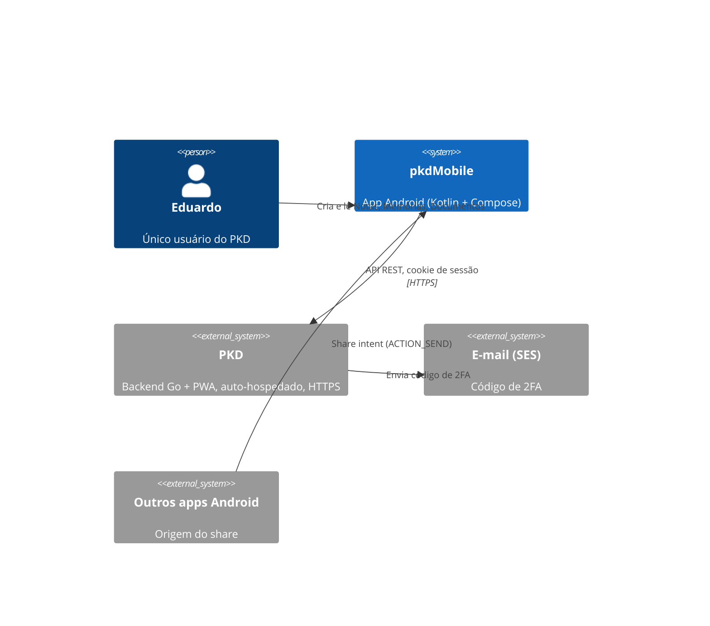

# Spec da v1 — pkdMobile (Android)

App Android para criar e ver **Notas** rapidamente, com acesso a **Memórias** e **Documentos** do PKD, também sem conexão. Termos: ver `CONTEXT.md`. Decisões de origem: `docs/wayfinder/map.md`.

## 1. Contexto (C4 — nível 1)

## 2. Escopo

| Tipo | Na v1 |
|---|---|
| **Nota** | Criar, ver, editar (texto), buscar, pôr e tirar Tags, favoritar. |
| **Memória** | Criar e ver. |
| **Documento** | Só leitura: Árvore, busca, corpo, Subdocumentos, Associações. Arquivos: ver e baixar sob demanda. |

Fora da v1: ver a seção 9.

## 3. Telas (direção A · Notas-first)

Referência visual: [`docs/wayfinder/prototypes/01-direcao-visual.prototype.html`](wayfinder/prototypes/01-direcao-visual.prototype.html).

- **Login:** URL do PKD (só `https://`) + senha; depois, código de 2FA se o aparelho for novo.
- **Barra inferior:** Notas · Memórias · Documentos · Busca.
- **Notas (tela inicial):** feed de cartões em 2 colunas (título = 1ª linha, trecho, Tags); favoritas primeiro. FAB → bottom sheet "Nova Nota".
- **Memórias:** lista cronológica agrupada por mês (dia + dia da semana). FAB → bottom sheet "Nova Memória" (data, título, detalhes).
- **Documentos:** Árvore colapsável. Sem FAB.
- **Busca:** campo + resultados agrupados por tipo (Notas, Memórias, Documentos). Offline: busca local com o aviso "resultados parciais".
- **Detalhe** (tela cheia, sem barra inferior, com voltar):
  - Nota: texto editável com salvamento automático; Tags; favoritar.
  - Memória: data, título, detalhes, `MEM-…`.
  - Documento: caminho na Árvore, corpo (WebView só leitura), Subdocumentos, Associações (Notas relacionadas, Arquivos, Links externos).
- **Share:** bottom sheet "Nova Nota" com o conteúdo recebido; salvar põe a Nota na fila de envio.
- **Logout e Não enviados:** ícones na barra de Notas (sem tela de Configurações: sem biometria, ela só teria esses dois itens).
- **Tema:** tokens de cor da PWA em Material 3; claro/escuro segue o sistema. Ícones: Boxicons.

## 4. Autenticação

- Login do PKD por sessão: `POST /api/login` → 2FA (`POST /api/login/2fa`) se o aparelho não for confiável → cookies `pkd_session` + `pkd_device`. Mutações levam `X-CSRF-Token` (cookie `pkd_csrf`).
- Só HTTPS; o app recusa `http://`.
- Um servidor, uma sessão. Trocar de URL exige logout.
- Os cookies ficam cifrados (Android Keystore). A senha nunca é guardada; sessão expirada (30 dias sem uso) pede a senha de novo.
- Sem biometria/PIN (decisão do usuário, 2026-09-27).

## 5. Offline

- **Cache de leitura (Room):** todas as Notas e Memórias, a estrutura da Árvore, os corpos dos Documentos abertos (LRU).
- **Fila de envio (WorkManager):** criar e editar Notas (texto, Tags, favorita) e criar Memórias. Envio em ordem. Criações levam `idempotency_key` (UUID gerado no app).
- **Conflito:** a última escrita vence (o PKD tem um único usuário).
- **Atualização:** ao abrir o app e ao voltar do background, pull-to-refresh, e depois de esvaziar a fila. Baixa as listas completas (`GET /api/notes`, `/api/memories`, `/api/tree`). Sem sync em background.
- **Falhas da fila:**
  - `401` → mantém a fila e pede login;
  - `5xx`/rede → tenta de novo na próxima atualização;
  - `4xx` definitivo → o item vai para **Não enviados** (copiar, recriar ou descartar).
- **Logout:** apaga cache, fila e cookies. Com fila não vazia, avisa antes e permite cancelar.

## 6. Share

- O app recebe `ACTION_SEND` (texto/URL) e cria uma Nota com a Tag `#android`.
- A Nota vai pela fila de envio para `POST /api/capture` com `idempotency_key`. O PKD busca o Open Graph (título) do link.
- Offline, a Nota aparece com o link cru e ganha o título quando a fila é enviada.
- A PWA segue a regra antiga (Nota `#captura`); o app manda `tags: ["android"]`, que o PKD usa no lugar do `#captura` padrão (ajuste 2026-09-28).

## 7. Stack e entrega

Ver [`docs/adr/0001-stack-kotlin-compose.md`](adr/0001-stack-kotlin-compose.md).

- Kotlin + Jetpack Compose (Material 3), minSdk 31.
- APK assinado no GitHub Releases pelo GitHub Actions; atualizações pelo Obtainium. A chave de assinatura fica em GitHub Secrets. Dependabot ativo.

## 8. Pré-requisitos no PKD (antes da v1)

1. **Encerrar as outras sessões:** endpoint + botão na Administração da PWA que apaga todas as sessões menos a atual.
2. **`POST /api/capture`:** cria **Nota** (não Documento) com `#captura`, aceita `idempotency_key` e mantém a busca de Open Graph. Os Documentos `#captura` existentes ficam como estão.

As duas mudanças são aditivas e a PWA continua funcionando.

## 9. Fora da v1

- Upload de arquivos e câmera (candidato à v1.1).
- Notificações (candidato: "Neste dia", sem backend).
- Converter Nota (continua na PWA). Apagar Nota: feito no app (ajuste 2026-09-28, fora do mapa original).
- Editar Memórias.
- Edição rica de Documentos (TipTap).
- Múltiplas instâncias PKD.
- Graph View, Chat com documentos, Administração.
- Sync em background, tokens Bearer por aparelho, Google Play.
